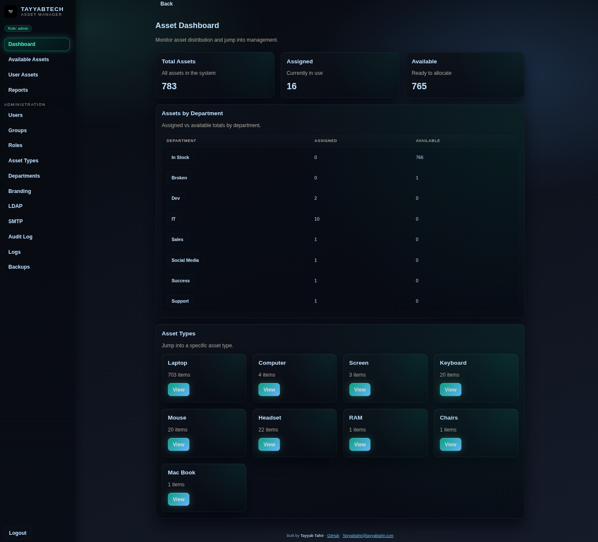
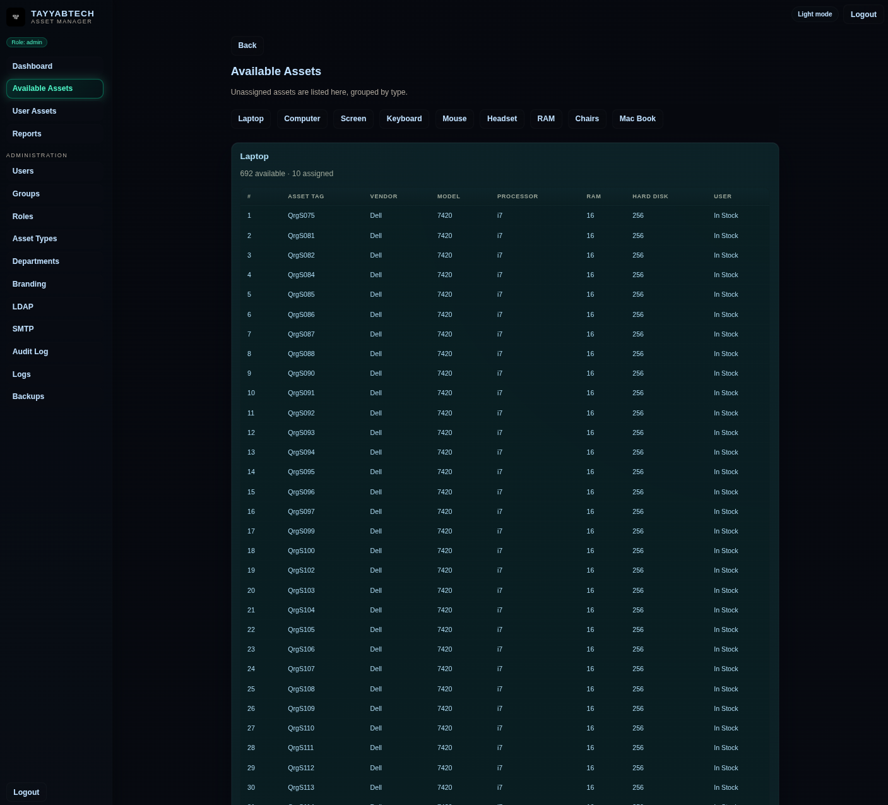
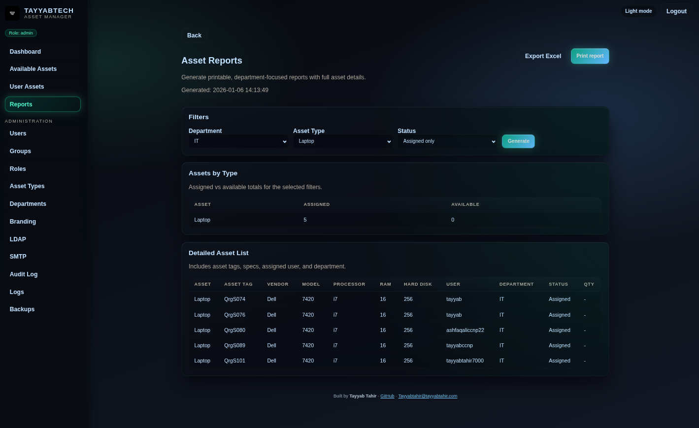

# Inventory Asset Manager — Postgres Deployment


> A sleek, production‑ready inventory manager with LDAP sync, asset tracking, audit logs, reporting, and email notifications.

---

## ✨ Highlights
- LDAP user & group sync
- Asset assignment history + comments
- Audit logs + realtime logs
- SMTP notifications + monthly/low‑stock reports
- Role‑based access control
- Import/Export (admin only)
- Postgres‑backed persistence

---

## 🖼️ Screenshots

| Dashboard | Assets | Reports |
| --- | --- | --- |
|  |  |  |

---

## ✅ Prerequisites
- Docker + Docker Compose
- Port `5001` open (or change it in `docker-compose.yml`)

---

## 🚀 Quick Start (Postgres)

```bash
git clone https://github.com/tayyabtahir143/AssetManager.git
cd AssetManager
sudo docker compose up -d --build
```

Open the app:
```
http://localhost:5001
```

---

## ⚙️ Configuration

This deployment is already configured for Postgres inside `docker-compose.yml`:

```yaml
DATABASE_URL=postgresql://inventory:inventory@db:5432/inventory
SECRET_KEY=change-this-to-a-strong-secret
```

Recommended: replace `SECRET_KEY` with a strong random string.

---

## 🧱 Data Persistence

Postgres data is stored in:
```
./data/postgres
```

You can back up data by copying this folder or using the built‑in backup UI.

---

## 🛠 Useful Commands

Stop services:
```bash
sudo docker compose down
```

Restart services:
```bash
sudo docker compose restart
```

View logs:
```bash
sudo docker compose logs -f
```

---

## 🔐 Default Access

If you have not changed the default users, use:

- **admin / admin** (full access)

If you removed defaults, log in with LDAP or your configured users.

---

## 📚 Product Overview

Inventory Asset Manager is designed for IT teams managing physical and consumable assets. It supports:
- Full asset lifecycle tracking
- LDAP user/group sync
- Role-based access
- Audit and realtime logs
- Reports, print, and Excel exports
- SMTP notifications for key events

---

## 🧭 Administration Guide

### 1) Branding
`Administration → Branding`
- Upload logo
- Set company name
- Apply consistent identity across UI and reports

### 2) Roles & Permissions
`Administration → Roles`
- Create roles for read/add/edit/delete/bulk‑delete
- Assign roles to users or LDAP groups
- Use separate app‑admin roles for administrative pages

### 3) Departments
`Administration → Departments`
- Create business departments (IT, HR, Sales, etc.)
- Dept list is used across asset forms and reporting

### 4) LDAP Integration
`Administration → LDAP`
- Configure LDAP server, bind DN, base DN, filters
- Test connection from UI
- Sync users and groups
- Assign roles to groups for centralized access control

### 5) SMTP & Notifications
`Administration → SMTP`
- Configure SMTP host/port/encryption
- Define recipients and event types
- Enable monthly reports and low‑stock alerts

### 6) Backups
`Administration → Backups`
- Export configuration backup
- Restore configuration in one step

---

## 🧾 Asset Management

### Asset Types
`Administration → Asset Types`
- Built‑in types: Laptop, Computer, Screen, Headset, Keyboard, Mouse, RAM
- Custom types: define fields, dropdowns, and asset tags

### Asset Status
- **In Stock** → available, no dept
- **Assigned** → assigned to user + dept
- **Broken** → not usable
- **Write Off** → permanently removed from use

### Assignment History & Comments
Each asset keeps:
- full assignment history (who assigned to whom + timestamps)
- last two previous users at a glance
- comment log for notes and maintenance info

### Available Assets
- Shows only unassigned items
- Grouped by type
- Displays asset tags, vendor, model, and specs

---

## 📊 Reports & Printing
`Reports`
- Department and asset‑type filters
- Status filters (Assigned, In Stock, Broken, Write Off, All)
- Printable layout for physical export

---

## 🧪 Audit & Realtime Logs
- **Audit Log**: who did what, when, and with which asset
- **Realtime Logs**: application logs for troubleshooting

---

## 📥 Import & Export (Admin only)
- Excel import/export with strict headers per asset type
- Duplicate asset tags blocked
- Useful for bulk onboarding or migration

---

## 🔐 Security Notes
- Change `SECRET_KEY` before production
- Use LDAP groups for centralized role management
- Limit admin‑only functions to trusted users

---

## 📫 Support / Contact

- **Name:** Tayyab Tahir  
- **GitHub:** https://github.com/tayyabtahir143  
- **Email:** Tayyabtahir@tayyabtahir.com
